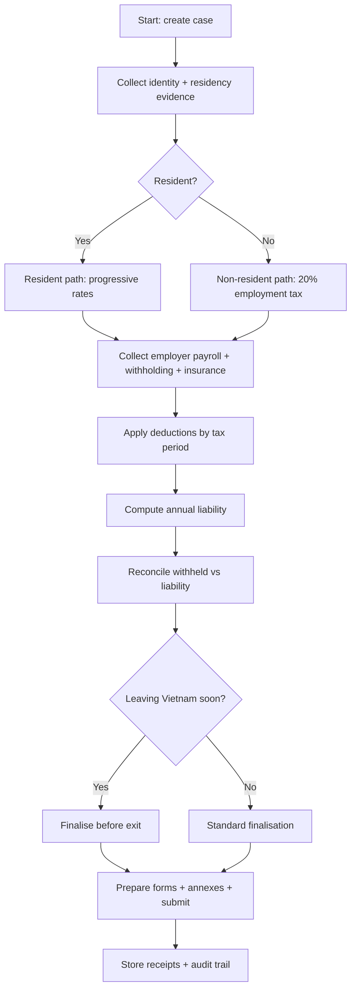
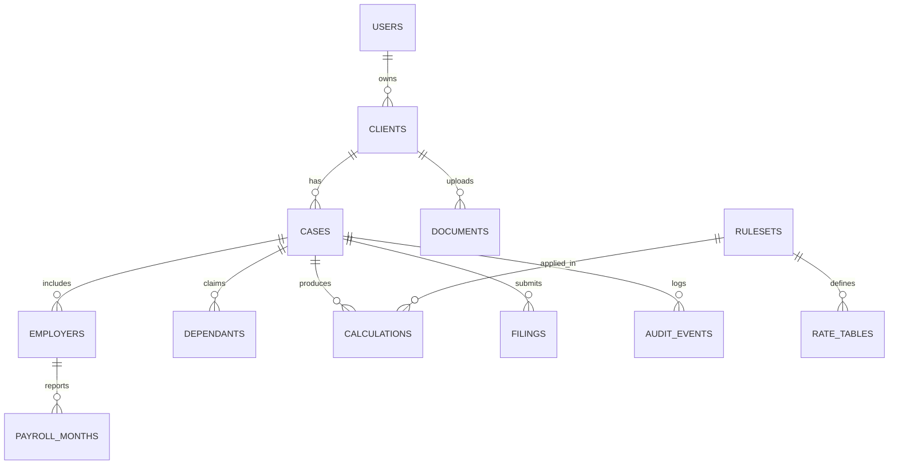

# Premium PIT finalisation website for foreigners in Việt Nam

## Executive summary

A premium PIT finalisation platform for foreigners in entity["country","Việt Nam","country in southeast asia"] should be engineered as a **versioned rules engine + evidence-backed knowledge base**, because three major regulatory “switches” affect calculations and workflows: **(a)** tax residency and resident/non‑resident rate structure, **(b)** **family circumstance deduction amounts** changing from tax period 2026, and **(c)** **new PIT and tax administration laws taking effect 01/07/2026** (meaning your system must support mid‑year legal transitions and tax‑period versioning). citeturn66view0turn65view0turn57view0turn51search11turn53view0

For expatriate salary earners, your “happy path” product is: **collect payroll documents from all employers → determine residency → compute annual liability under the progressive tariff (resident) or flat rate (non‑resident) → reconcile with withholding → produce/refile the official finalisation return and annexes** (with an explicit branch when the taxpayer is a resident foreigner leaving Vietnam: they must finalise before exit). citeturn66view0turn4view3turn4view5turn13view4

For mandatory insurance, the current framework explicitly covers **foreign employees with fixed‑term labour contracts ≥12 months**, with key exemptions (intra‑company transferee, already at retirement age at signing, or treaty override). Social insurance employee share is **8%** and employer share is **3% + 14%** (with the occupational accident/disease fund typically **0.5%** employer, with a reduced **0.3%** pathway for eligible employers). Health insurance is currently implemented at **4.5%**, split **2/3 employer and 1/3 employee**. Unemployment insurance is defined in the Employment Law as applying to “employees” who are Vietnamese citizens, which strongly implies foreigners are outside mandatory unemployment insurance. citeturn38view2turn38view3turn38view4turn40view1turn49view2turn41view0turn36view1turn36view3

Premium UX and compliance requirements should be built around **high‑sensitivity personal data** (passport, work permit, tax IDs, payroll, dependants). This requires: consent/notice UX, audit logs, least‑privilege access, encryption, and (if exporting Vietnamese citizen personal data) cross‑border transfer impact‑assessment dossiers and Ministry of Public Security submission flows described in the PDP Decree. citeturn58view4turn58view2turn58view3turn56search1

Unspecified by user (and therefore treated as unspecified): pricing, hosting provider, payment rails, SLA tiering, customer support hours, and whether you will act as a tax agent vs “guided self‑service”.

## PIT for foreigners

### Legal anchors you must cite inside the knowledge base

Your canonical “law nodes” should reference:

- Consolidated PIT Law (VBHN‑VPQH) for: **taxpayer scope**, **resident vs non‑resident definition**, and **10 taxable income categories**. citeturn66view0  
- The statutory **progressive tariff** (resident employment income) and the **20% non‑resident employment tax**. citeturn4view3turn4view4turn4view5  
- Circular 111/2013/TT‑BTC for: **withholding rules**, **finalisation responsibilities**, **employer finalisation authorisation**, and **resident foreigner exit finalisation**. citeturn11view0turn12view0turn12view1turn13view4  
- Family circumstance deduction amounts for tax periods 2025 and 2026+ (from the Tax Department guidance letter and the National Assembly Standing Committee resolution). citeturn65view0turn57view0  
- Double tax agreement (DTA) administration guidance: Circular 205/2013/TT‑BTC (and practical tax authority interpretations/letters on dossier requirements). citeturn63search0turn63search6

### Residency rules and tax scope

The PIT law defines **resident individuals** as those meeting either: **(i)** presence in Vietnam ≥183 days in a calendar year or in 12 consecutive months from first arrival, or **(ii)** “regular residence” in Vietnam (permanent residence or rented house under a lease with term). Non‑residents are those not meeting resident conditions. citeturn66view0

Tax scope follows residency: residents are taxable on income arising **inside and outside** Vietnam, while non‑residents are taxable on income arising **within** Vietnam. citeturn66view0

**Implication for your UI and validator:** your onboarding must capture (a) arrival/departure dates and (b) evidence of “regular residence” (lease term, address), because residency drives the entire computation path and the availability of deductions. citeturn66view0

### Taxable income categories

The PIT law enumerates taxable income categories (excluding exempt income): **business**, **salary/wages**, **investment capital**, **capital transfer**, **real estate transfer**, **prizes**, **copyright/royalties**, **commercial franchising**, **inheritances**, **gifts**. citeturn66view0

For a foreigners‑focused finalisation service, you should treat “salary/wages” as the core workflow, while still supporting disclosure and flagging of other categories (especially investment/capital transfer/real estate) as “complex cases” that may require separate declaration logic and/or additional services. citeturn66view0

### Progressive rates and non‑resident flat rate

The resident progressive monthly tariff (7 brackets) is statutory. Your calculator must support both **monthly** and **annualised** brackets (annual thresholds are monthly thresholds × 12). citeturn4view3turn4view4

| Bracket | Taxable income per month (VND) | Rate |
|---:|---:|---:|
| 1 | Up to 5,000,000 | 5% |
| 2 | Over 5,000,000 to 10,000,000 | 10% |
| 3 | Over 10,000,000 to 18,000,000 | 15% |
| 4 | Over 18,000,000 to 32,000,000 | 20% |
| 5 | Over 32,000,000 to 52,000,000 | 25% |
| 6 | Over 52,000,000 to 80,000,000 | 30% |
| 7 | Over 80,000,000 | 35% |

citeturn4view3turn4view4

For non‑resident employment income, the PIT law provides a **20%** rate on taxable income from wages/salaries. citeturn4view5

### Exemptions and deductions you must model

**Family circumstance deduction amounts (high‑impact, must be tax‑period versioned)**

The 2026 Tax Department guidance letter (published on the Government portal) explicitly states that for **the 2025 finalisation**: taxpayer deduction = **11,000,000 VND/month** (132m/year) and dependant deduction = **4,400,000 VND/month**; and that from tax period 2026 these are replaced by the new resolution: taxpayer = **15,500,000 VND/month** (186m/year) and dependant = **6,200,000 VND/month**. citeturn65view0turn57view0

| Tax period | Taxpayer deduction | Dependant deduction | Authority |
|---|---:|---:|---|
| 2025 | 11.0m VND/month | 4.4m VND/month | Tax authority finalisation guidance citeturn65view0 |
| 2026+ | 15.5m VND/month | 6.2m VND/month | National Assembly Standing Committee resolution citeturn57view0turn65view0 |

**Withholding and finalisation procedure anchors**

Circular 111 details salary/wage withholding and finalisation mechanics and provides that a **resident foreigner exiting Vietnam must finalise PIT before leaving**. citeturn11view0turn12view0turn12view1turn13view4

Because annual statutory deadlines were not captured in the extracted passages within this research set, treat “deadline display” as a **configurable rule** sourced annually from official Tax Department guidance letters (e.g., the 2026 letter for tax period 2025 finalisation). citeturn65view0

### Official forms and workflows

A tax authority Q&A page identifies the individual PIT finalisation return and annexes commonly used in practice, including **Form 02/QTT‑TNCN** and annexes **02‑1/BK‑QTT‑TNCN**, **02‑2/BK‑QTT‑TNCN** (and a “Phụ lục bảng kê”) for salary/wage finalisation. citeturn19search3

**Sample operational workflow (high‑level)**
- Identify residency status and tax period(s) to finalise. citeturn66view0  
- Aggregate income and withholding from **all employers**; detect multiple‑employer case (requires individual finalisation rather than simple authorisation in many scenarios). citeturn12view1  
- Apply deductions by tax period (2025 vs 2026+) and compute annual liability via progressive schedule (resident) or 20% (non‑resident). citeturn4view3turn4view5turn65view0turn57view0  
- Reconcile with withheld tax to determine refund/arrears; prepare filing package. citeturn11view0turn12view0  
- If resident foreigner is departing Vietnam, prioritise and complete finalisation before exit. citeturn13view4  

Mermaid workflow suggestion is provided below.

## Insurance contributions for foreigners

### Compulsory social insurance

The Social Insurance Law text explicitly includes **foreign employees working in Vietnam** when working under a **fixed‑term labour contract of at least 12 months**, excluding: **(a)** intra‑company transferees, **(b)** those already at retirement age at contract signing, or **(c)** where an international treaty provides otherwise. citeturn38view2

Contribution structure in the law splits:
- **Employee:** 8% of salary base to the retirement & death fund. citeturn38view3  
- **Employer:** 3% (sickness & maternity) + 14% (retirement & death). citeturn38view4  

Salary base cap uses **“mức tham chiếu” (reference level)**: minimum equals the reference level and maximum equals **20× reference level** at the time of contribution. citeturn38view3

### Occupational accident & disease fund

The Government decree on this fund sets the **default employer rate at 0.5% of the payroll base used for social insurance**, with a reduced **0.3%** rate for eligible employers meeting safety/compliance conditions. citeturn40view1

### Health insurance

The amended Health Insurance Law explicitly includes **foreign employees** with a **fixed‑term labour contract ≥12 months** (with similar exemptions: intra‑company transferee, retirement age at signing, or treaty override). citeturn49view2turn49view3

The implementing decree sets the **current payable rate** for the employer/employee group at **4.5% of the salary base used for compulsory social insurance**, split **2/3 employer and 1/3 employee**. citeturn41view0turn42view3

### Unemployment insurance

The Employment Law defines “employee” as a **Vietnamese citizen**; unemployment insurance provisions are built on that definition, so foreigners are not within the mandatory unemployment insurance scope under this definition‑based structure. citeturn36view1turn36view2turn36view3

### Contribution rate table for your calculator

| Item | Employee rate | Employer rate | Base | Key notes |
|---|---:|---:|---|---|
| Social insurance (retirement & death) | 8% citeturn38view3 | 14% citeturn38view4 | SI salary base (cap 20× reference level) citeturn38view3 | Foreigner coverage requires ≥12‑month fixed term contract + no exemption citeturn38view2 |
| Social insurance (sickness & maternity) | 0% | 3% citeturn38view4 | SI salary base | Same eligibility as above citeturn38view2 |
| Occupational accident/disease fund | 0% | 0.5% (or 0.3% if approved) citeturn40view1 | SI payroll base | Employer‑side only citeturn40view1 |
| Health insurance | 1.5% (1/3 of 4.5%) citeturn41view0 | 3% (2/3 of 4.5%) citeturn41view0 | Salary base for compulsory SI citeturn41view0 | Foreigner inclusion in law (≥12‑month fixed term) citeturn49view2 |
| Unemployment insurance | Not applicable to foreigners | Not applicable | — | Employee definition is Vietnamese citizen citeturn36view1 |

## Calculator formulas and algorithms

### Core data inputs

Minimum input set for foreigners on salary/wage income:
- Tax period(s) covered (calendar year and “finalisation year”). citeturn65view0  
- Residency evidence: presence days, 12‑month window, lease/residence evidence. citeturn66view0  
- Employer list and payroll summary per employer: gross income, taxable vs non‑taxable items, PIT withheld, insurance contributions (employee share), months paid. citeturn66view0turn11view0  
- Dependants: count + eligibility proof + effective months (versioned by tax period). citeturn65view0turn57view0  
- DTA claim flag + residence certificate and dossier fields (if applicable). citeturn63search0turn63search6  

### Algorithm for residency classification

1. Compute `days_in_vn_calendar_year`.  
2. Compute `days_in_vn_12_month_window` from first entry date.  
3. If either ≥183 → `resident = true`. citeturn66view0  
4. Else if “regular residence” is established (e.g., lease with term) → `resident = true`. citeturn66view0  
5. Else `resident = false` (non‑resident). citeturn66view0  

### Resident PIT on employment income

Define, per month `m`:
- `gross_income_m`
- `employee_SI_m` (social insurance employee share)
- `employee_HI_m` (health insurance employee share)
- `personal_deduction_m` (11.0m in 2025; 15.5m in 2026+) citeturn65view0turn57view0
- `dependant_deduction_m = dependant_count_m * dependant_amount_m` (4.4m in 2025; 6.2m in 2026+) citeturn65view0turn57view0

Monthly taxable income (employment) model:
- `taxable_income_m = max(0, gross_income_m - employee_SI_m - employee_HI_m - personal_deduction_m - dependant_deduction_m - other_deductibles_m)`

Then:
- `PIT_m = progressive_tax(taxable_income_m)` using the 7 statutory brackets. citeturn4view3turn4view4

Annual approach (recommended for finalisation to reduce rounding drift):
1. Compute annual taxable income from aggregated months:  
   `taxable_income_year = Σ taxable_income_m`  
2. Compute annual PIT liability by applying **annualised brackets** (monthly thresholds × 12). citeturn4view3turn4view4  
3. Compare to total withholding:  
   `balance = PIT_liability_year - PIT_withheld_year`  
   - If `balance > 0`: taxpayer owes arrears.  
   - If `balance < 0`: potential refund. citeturn11view0turn12view0  

### Non‑resident PIT on employment income

For non‑resident salary/wage taxable income:
- `PIT = 20% * taxable_income` (no resident‑style deductions path). citeturn4view5

### Insurance contribution calculations

Let `SI_base_m` be salary base for compulsory social insurance (subject to cap 20× reference level). citeturn38view3

- Employee social insurance: `emp_SI_m = 0.08 * SI_base_m` citeturn38view3  
- Employer social insurance: `er_SI_m = 0.03 * SI_base_m + 0.14 * SI_base_m` citeturn38view4  
- Employer occupational accident/disease fund: `er_acc_m = rate_acc * SI_base_m` where `rate_acc` is 0.5% default or 0.3% if approved. citeturn40view1  
- Health insurance (on SI base): `HI_total_m = 0.045 * SI_base_m`, split:  
  - `er_HI_m = (2/3) * HI_total_m`  
  - `emp_HI_m = (1/3) * HI_total_m` citeturn41view0  

### Validation rules and edge cases

**Multiple employers (common expat scenario).** Require: multiple withholding certificates, aggregate income and withheld tax across employers, disallow “simple employer‑finalise” path unless the Circular 111 authorisation conditions are met for that tax year scenario. citeturn12view1turn11view0

**Resident foreigner leaving Vietnam.** Hard‑block completion until “exit date” is captured and the process routes to “finalise before departure” checklist. citeturn13view4

**Tax period rule change (2025 vs 2026 deductions).** Enforce tax‑period‑based deduction amounts; do not let users apply 2026 amounts to the 2025 finalisation. citeturn65view0turn57view0

**DTA/foreign tax credit.** If `DTA_claim = true`, require uploading a residence certificate and treaty dossier fields. Keep the DTA logic as a “manual review gate” unless and until you fully implement the Circular 205 procedural/limitation rules; store the authority basis (Circular 205) and any tax authority letter relied upon. citeturn63search0turn63search6

## Data model and knowledge base schema

### Database tables

Below is a practical relational schema for a premium “guided finalisation + audit trail” product.

| Table | Key fields (examples) | Relationships |
|---|---|---|
| `users` | `user_id`, `email`, `phone`, `role`, `mfa_enabled`, `created_at` | 1‑to‑many `cases` |
| `clients` | `client_id`, `user_id`, `full_name`, `nationality`, `passport_no`, `tax_id`, `vn_address`, `consent_version` | 1‑to‑many `cases`, `documents` |
| `cases` | `case_id`, `client_id`, `tax_year`, `status`, `service_tier`(unspecified), `submitted_at` | 1‑to‑many `employers`, `income_items`, `calculations`, `filings` |
| `residency_periods` | `case_id`, `arrival_date`, `departure_date`, `days_counted`, `regular_residence_flag`, `resident_result`, `evidence_doc_id` | many‑to‑1 `cases` |
| `employers` | `employer_id`, `case_id`, `name`, `tax_code`, `address`, `employment_type`, `contract_start`, `contract_end` | 1‑to‑many `payroll_months` |
| `payroll_months` | `payroll_id`, `employer_id`, `month`, `gross_income`, `taxable_income_reported`, `pit_withheld`, `si_base`, `emp_si`, `emp_hi` | many‑to‑1 `employers` |
| `dependants` | `dependant_id`, `case_id`, `relation`, `id_no`, `start_month`, `end_month`, `eligibility_docs` | many‑to‑1 `cases` |
| `rulesets` | `ruleset_id`, `name`, `effective_from`, `effective_to`, `source_citation_ref` | referenced by `calculations` |
| `rate_tables` | `rate_table_id`, `ruleset_id`, `type`(PIT_brackets, deductions, insurance_rates), `json_blob` | many‑to‑1 `rulesets` |
| `calculations` | `calc_id`, `case_id`, `ruleset_id`, `calc_hash`, `inputs_snapshot`, `outputs_snapshot`, `created_at` | many‑to‑1 `cases` |
| `filings` | `filing_id`, `case_id`, `form_code`(e.g., 02/QTT‑TNCN), `status`, `submitted_channel`(eTax/manual), `submission_receipt` | many‑to‑1 `cases`; links to `filing_documents` |
| `documents` | `doc_id`, `client_id`, `case_id`, `type`(passport, contract, payslip, withholding cert, residence cert), `storage_uri`, `checksum`, `uploaded_at` | referenced widely |
| `audit_events` | `event_id`, `user_id`, `case_id`, `action`, `timestamp`, `ip`, `metadata` | immutable audit trail |

**Why this structure is “premium”:** it supports reproducible calculations (`inputs_snapshot` + `ruleset_id`), evidence‑based decisions (linked docs), and defensible audit logs. The ruleset versioning is essential because family deductions change from 2026 and new PIT law takes effect 01/07/2026. citeturn65view0turn57view0turn51search11

### Knowledge base content map

Your knowledge base should be “question → answer → legal basis → practical checklist”. Example article clusters:

- “Am I a tax resident?” (183‑day test; regular residence; consequences) citeturn66view0  
- “Resident vs non‑resident salary tax rates” (progressive vs 20%) citeturn4view3turn4view5  
- “Family circumstance deductions for 2025 vs 2026+” citeturn65view0turn57view0  
- “When must foreigners finalise before leaving Vietnam?” citeturn13view4  
- “Insurance obligations for expats (SI/HI; no unemployment insurance)” citeturn38view2turn41view0turn36view1  
- “Using a tax treaty/DTA: what documents you need” (Circular 205 plus tax authority practice letters) citeturn63search0turn63search6  

## Premium UX, security, and compliance

### Required pages and flows

Minimum premium IA (English + Vietnamese):
- Landing (service tiers: unspecified), Eligibility wizard, Pricing (unspecified), FAQ/Knowledge base, Client dashboard, “New case” workflow, Document upload centre, Calculator review, Filing submission tracking, Support chat/ticketing (optional, unspecified), and an Audit/receipts vault.

### Document upload checklist (foreigner salary case)

- Passport (bio page), visa/TRC, work permit (if applicable)  
- Labour contract(s) (start/end dates to validate ≥12‑month threshold for SI/HI) citeturn38view2turn49view2  
- Payslips / payroll summaries for each employer  
- PIT withholding certificates / employer confirmations (all employers) citeturn11view0  
- Dependant documents (birth/marriage, support evidence) for deduction months citeturn65view0  
- If claiming DTA relief: residence certificate + dossier items (manual review) citeturn63search0turn63search6  

### Privacy/security controls you should implement

The Personal Data Protection Decree contains concrete requirements you can operationalise:

- **Consent must be explicit, purpose‑bound, and recordable**; silence is not consent; consent must be in a reproducible format (including electronic). citeturn58view4  
- **Impact‑assessment dossiers** for personal data processing must be prepared and available; a copy must be submitted to the Ministry of Public Security’s cybersecurity unit within 60 days from processing commencement (per cited provisions). citeturn58view2  
- **Cross‑border transfer of Vietnamese citizen personal data** requires a transfer impact‑assessment dossier and submission/availability requirements (including the 60‑day submission window), plus conditions for potential suspension. citeturn58view3  

Additionally, you should align platform operation with cybersecurity obligations under the Cybersecurity Law (high‑level legal basis). citeturn56search1

### Suggested mermaid diagrams

Workflow (onboarding → compute → file):



ER diagram (core entities):



## Official sources used and prioritised

The citations in this report link directly to official sources. Key pillars include:

- National legal database (vbpl.vn): PIT law (consolidated), insurance laws, decrees and circulars. citeturn66view0turn38view2turn49view2turn41view0turn40view1turn63search0  
- Government policy portal: family deduction resolution and 2025/2026 finalisation guidance letter excerpts. citeturn57view0turn65view0  
- Tax authority portals/subdomains: forms and treaty‑dossier practice letters. citeturn19search3turn63search6turn63search2  
- Data protection and cybersecurity law basis. citeturn58view4turn58view3turn56search1  

If you need a raw URL bundle for internal engineering tickets, use this (no commentary inside the block):

```text
https://vbpl.vn/
https://xaydungchinhsach.chinhphu.vn/
https://gdt.gov.vn/
```

## Sample calculations and test cases

### Example resident case (tax period 2026 example)

Assumptions (illustrative):
- Resident; 12 months in 2026. Residency criteria and scope per PIT law. citeturn66view0  
- 1 employer; SI base = gross for simplicity (your system must separate taxable/non‑taxable components). citeturn66view0turn38view3turn41view0  
- Monthly gross = 100,000,000 VND.
- No dependants.
- Apply 2026 taxpayer deduction = 15.5m/month. citeturn57view0turn65view0  

Steps:
1. Employee SI = 8% × 100m = 8m. citeturn38view3  
2. Employee HI = 1.5% × 100m = 1.5m (since 4.5% split 1/3). citeturn41view0  
3. Taxable income ≈ 100m − 8m − 1.5m − 15.5m = 75m/month. citeturn4view3turn57view0turn38view3turn41view0  
4. Apply progressive bracket schedule to 75m/month. citeturn4view3turn4view4  

Your website should show both:
- bracketed computation (explainability), and
- annualised reconciliation (to match finalisation reality). citeturn4view3turn4view4turn11view0  

### Example 2025 finalisation deduction regression test

Given the tax authority guidance letter: for finalisation year 2025, use 11m + 4.4m (not 15.5m + 6.2m). citeturn65view0turn57view0

**Test:** same gross, same insurance, tax year 2025 → taxable income increases by 4.5m/month compared with 2026, so PIT liability must increase accordingly.

### Non‑resident test

Input: non‑resident + Vietnam‑source employment taxable income 50m/month → PIT = 20% × 50m = 10m/month. citeturn4view5turn66view0

### Leaving Vietnam test

Condition: resident foreigner has exit date before completing finalisation; system must require “finalise before exit” workflow completion. citeturn13view4

### DTA claim test

If DTA claim flag is enabled, system must require residence certificate upload and route to manual review, storing Circular 205 as the legal basis for treaty procedure. citeturn63search0turn63search6